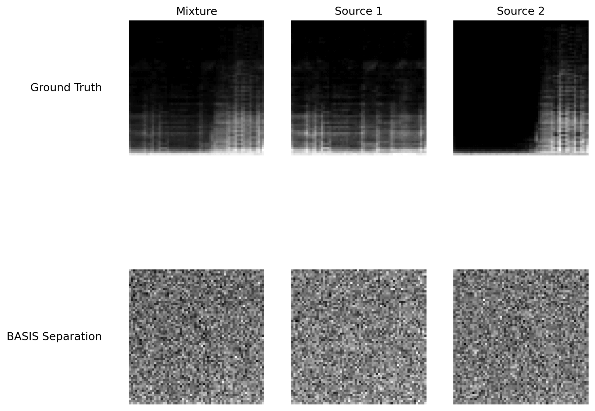

# Multi-Modal Deep Generative Audio Source Separation



Welcome to the code repository accompanying the MSc thesis **Multi-Modal Deep Generative Audio Source Separation**, supervised by [Dr Brooks Paige](https://tbrx.github.io/). This thesis was written in the scope of the MSc Machine Learning degree at University College London (UCL). The repository contains the code used to train the models, run the algorithms and conduct the experiments detailed in the thesis, focusing on variational autoencoders (VAEs) applied to the challenge of separating mixed audio signals, with the optional inclusion of visual data to enhance the separation performance.

Disclaimer: Some of the code in the `models` folder is **not mine**. It is copied from the [Self-supervised BSS via Multi-Encoder AE](https://github.com/webstah/self-supervised-bss-via-multi-encoder-ae) repository. The remaining code was written by me.

## Repository Structure

```bash
.
├── analyse_study.py                      # Script for analyzing the optuna study results
├── audio_spectrogram_conversion.py       # Helper functions for audio-spectrogram conversion
├── clean_up_training_images.py           # Cleans up training dataset images
├── create_elbo_confusion_matrix.py       # Generates ELBO confusion matrices
├── create_prediction_figures.py          # Generates figure showing different methods' separations
├── data/
│   ├── preprocess_musdb.py               # Pre-processes the MUSDB18 dataset
│   ├── create_toy_dataset.py             # Generates a toy dataset for initial testing
│   └── preprocess_urmp.py                # Pre-processes the URMP dataset
├── nmf.py                                # Functions for computing the Non-negative Matrix Factorization (NMF)
├── evaluate_video_weights.py             # Evaluates video weights $\beta$
├── experiment.py                         # Main experiment script for uni-modal setup
├── experiment_video.py                   # Main experiment script for multi-modal setup
├── figures/
│   └── ...                               # Scripts for plotting experiment results
├── functions.py                          # General utility functions
├── functions_prior.py                    # Utility functions pertaining to the deep generative priors
├── generate_separation_samples.py        # Generates toy and MUSDB18 BASIS separation samples
├── generate_video_separation_samples.py  # Generates URMP separation samples
├── models/
│   └── ...                               # Different AE-BSS models
├── requirements.txt                      # Required Python libraries
├── train_video.py                        # Script for running the video classifier training
├── train_video_vae.py                    # Training script for URMP deep generative priors
├── train_class_vae.py                    # Training script for other deep generative priors
├── vincent_paper_implementation.py       # Implementation of the metrics in Vincent et al. (2006)
├── visualise_dataset.py                  # Generates a visual sample image of the datasets
├── vae_hp_opti.py                        # Optuna experiment evaluating optimal VAE hyperparameters
├── separate.py                       # Uni-modal BASIS separation scripts
├── separate_video.py                     # Bi-modal BASIS separation scripts
├── print_metric_results.py               # Prints the results from the experiment.py experiment as mean +- standard error
├── hp_opti.py                            # Uses optuna's TPE to optimise AE-BSS hyperparameters
├── hp_opti_basis.py                      # Uses optuna's TPE to optimise BASIS hyperparameters
└── new_bss_trainer.py                    # Train script for AE-BSS
```

## Requirements

Install the dependencies from the `requirements.txt` file before running the scripts:
```bash
pip install -r requirements.txt
```

The code was tested on Python version 3.11.2.

## Data download

The MUSDB18 data can be downloaded from https://sigsep.github.io/datasets/musdb.html and the URMP data from https://labsites.rochester.edu/air/projects/URMP.html.

## Credits

Code from the [AE-BSS](https://github.com/webstah/self-supervised-bss-via-multi-encoder-ae) repository from Webster et al. (2023) is used as part of this repository. [BASIS separation](https://github.com/jthickstun/basis-separation) was proposed by Jayaram et al. (2020).


